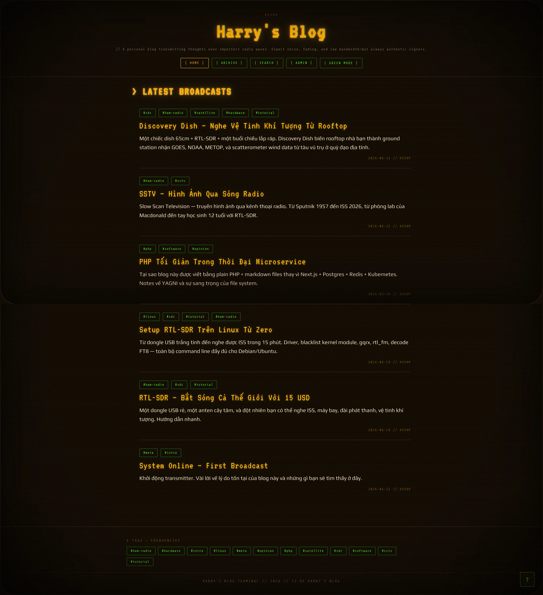
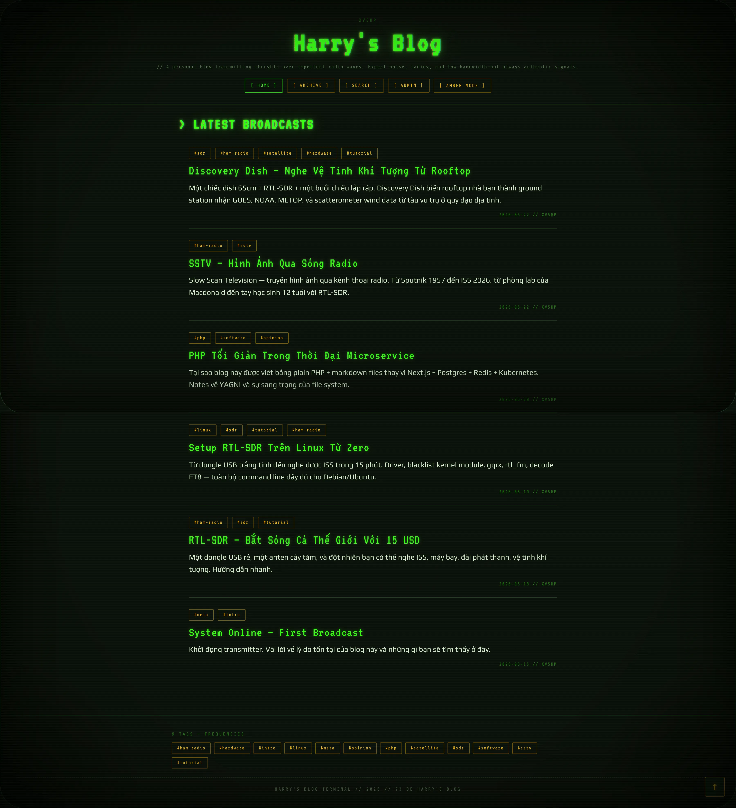
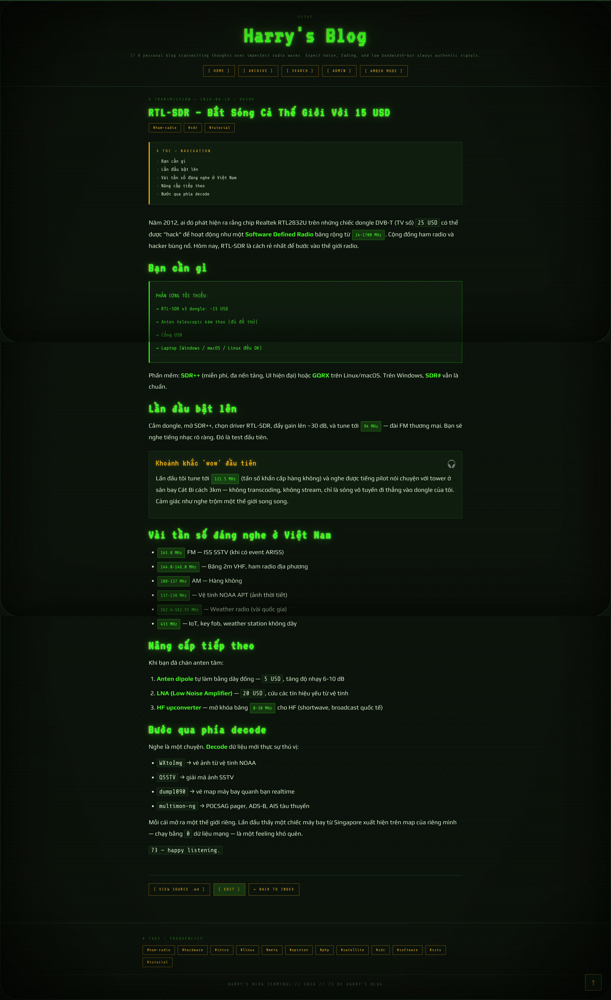
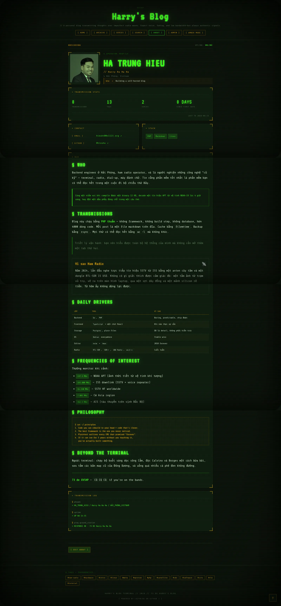
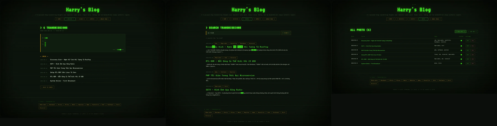

# LazyBlog

[](https://github.com/hieuha/LazyBlog/releases/latest)
[](LICENSE)
[](composer.json)

A simple personal blog. Posts are markdown files on disk, rendered by a few
thousand lines of plain PHP, served by Caddy + php-fpm. CRT phosphor terminal
aesthetic. AI-friendly by design — every post is also available as raw
`.md`, plus `llms.txt` / `llms-full.txt` indexes and a valid RSS 2.0 feed.

No database. No framework. No build step. Backup with `rsync`. Stylesheets
are split by concern and cache-busted via `filemtime`, so deploys invalidate
browser caches per-file without manual asset rotation.

```
┌─────────────────────────────────────────────────────┐
│  CRT terminal layout  ·  amber ↔ green theme        │
│  Phosphor vignette    ·  chromatic-aberration heads │
│  Markdown files       ·  llms.txt + raw .md + RSS   │
│  TOC + scrollspy      ·  code-block copy buttons    │
│  Browser admin UI     ·  EasyMDE + server-side prev │
│  Image full-bleed     ·  theme-tint multiply blend  │
│  YouTube auto-embed   ·  GFM tables · admonitions   │
│  Search + Archive     ·  reading-progress meter     │
│  SEO + JSON-LD        ·  Open Graph + Twitter Card  │
│  CSP + session hard.  ·  CSRF + atomic file writes  │
│  Writing streak card  ·  JSON-driven badge catalog  │
└─────────────────────────────────────────────────────┘
```

## Screenshots

| | |
|---|---|
|  |  |
| _Home — amber (default theme)_ | _Home — green theme toggle_ |
|  |  |
| _Single post — TOC, reading progress, full-bleed figure_ | _`/about` — operator profile, streak flame, JSON-driven badge grid_ |



_Left to right: `/archive` heatmap + posts by year · `/search` diacritic-insensitive highlighted snippets · `/admin` post management with EasyMDE editor._

## Stack

- PHP 8.2+ (no framework)
- Composer: `league/commonmark`, `symfony/yaml`, `vlucas/phpdotenv`
- Caddy + php-fpm
- Fonts via Google Fonts: VT323, Share Tech Mono, Play
- Docker Compose for local dev

## Quick start

**Local dev (Docker):**

```bash
cp .env.example .env
docker compose up -d --build
docker compose exec app composer install
open http://localhost:8080
```

**Local dev (no Docker):**

```bash
cp .env.example .env
composer install
php -S localhost:8000 -t public
```

**Production VPS (one-shot bare-metal install):**

```bash
# On Debian/Ubuntu/Raspbian (x86_64 or ARM) — run as root:
curl -fsSL https://raw.githubusercontent.com/hieuha/LazyBlog/refs/heads/main/scripts/install-vps.sh | sudo bash
```

(Interactive prompts read from `/dev/tty` so the curl-pipe pattern keeps
working. Prefer to read the script first? `curl -o install-vps.sh ... && sudo bash install-vps.sh`.)

The installer pins PHP 8.2, creates an isolated `lazyblog` system user,
drops a Caddy site on `:80`, sets up a daily backup cron, and prompts
for admin password + site title + URL + author + callsign + timezone.
See `docs/bare-metal-deployment-guide.md` for the manual step-by-step
playbook.

## Documentation

| File | Read when |
|------|-----------|
| `docs/writing-posts.md` | Authoring posts — frontmatter, admin UI, drafts |
| `docs/markdown-syntax.md` | What renders inside post `.md` files |
| `docs/configuration.md` | `.env` variables + URL route reference |
| `docs/bare-metal-deployment-guide.md` | Manual VPS playbook (what `install-vps.sh` automates) |
| `docs/docker-deployment-guide.md` | Docker workflow — dev compose + production image |
| `docs/backup-and-restore.md` | Backup script, cron, restore drill |
| `docs/seo-and-social.md` | OG tags, JSON-LD, llms.txt, RSS, how to test link previews |
| `docs/security.md` | CSP, session hardening, production checklist |
| `docs/system-architecture.md` | Request lifecycle, render pipeline, file layout |
| `docs/badges.md` | TX streak + customisable badge catalogue on `/about` |

## Project layout (high level)

```
LazyBlog/
├── public/              # web root (front controller + assets)
│   └── assets/          # base/effects/components/post/pages.css + admin.css + admin-editor.js
├── src/                 # PHP — Router, Controllers, PostRepository, MarkdownRenderer, Http...
│   └── Badges/          # gamification: BadgeKinds (compute templates) + BadgeRegistry (loader)
├── views/               # layout, post, home, tag, admin/*
├── content/             # markdown posts + about + badges.json (mostly gitignored)
│   ├── posts/           # YYYY-MM-DD-slug.md
│   ├── about.md         # /about page source
│   └── badges.json      # streak + badge catalogue (allowlisted in .gitignore)
├── scripts/
│   ├── install-vps.sh        # one-shot bare-metal installer
│   ├── hash-password.php
│   ├── backup-content.sh
│   └── test-gamification.php # streak math fixtures
├── docs/                # detailed docs (see table above)
├── Caddyfile.example    # production HTTPS site block
├── docker-compose.yml   # dev: Caddy + php-fpm bind-mount
├── Dockerfile           # dev image
├── Dockerfile.prod      # production: non-root, opcache, no bind mount
├── composer.json
└── .env.example
```

For the full file-by-file breakdown see `docs/system-architecture.md`.

## License

MIT.
